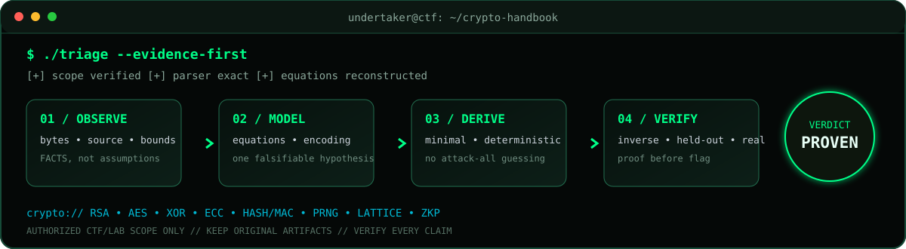

<p align="center">
  
</p>

<p align="center">
  
  
  
  
</p>

<p align="center">
  <strong>A practical field manual for Crypto CTFs:</strong><br />
  identify the construction, derive the exact weakness, implement the smallest solver, and prove the result.
</p>

<p align="center"><a href="README.vi.md">Đọc bằng tiếng Việt</a></p>

<p align="center">
  
</p>

---

## `./mission --status active`

This repository is a structured playbook for solving cryptography challenges in **authorized CTFs, labs, and intentionally vulnerable practice environments**. It favors deterministic analysis over guessing, attack-all tools, or unexplained scripts.

```text
artifact → exact equations → testable hypothesis → minimal solver → independent verification
```

The goal is not merely to recover a flag. The goal is to produce a solution that another player can understand, rerun, and verify.

<table>
  <tr>
    <td width="25%" align="center"><strong>01 — OBSERVE</strong><br /><sub>Preserve bytes, source, lengths, and bounds</sub></td>
    <td width="25%" align="center"><strong>02 — MODEL</strong><br /><sub>Write exact equations and serialization</sub></td>
    <td width="25%" align="center"><strong>03 — DERIVE</strong><br /><sub>Build one minimal deterministic solver</sub></td>
    <td width="25%" align="center"><strong>04 — VERIFY</strong><br /><sub>Re-run inverse operations and real checks</sub></td>
  </tr>
</table>

## `./quickstart --seven-steps`

1. Preserve the original challenge files and read the source or transcript first.
2. Use the [evidence-first workflow](docs/00-evidence-first-workflow.md).
3. Normalize encodings and confirm the mathematical model with [foundations](docs/01-math-and-encoding.md).
4. Route to the matching technique family using the table below.
5. Copy [`templates/solve.py`](templates/solve.py) or [`templates/solve.sage`](templates/solve.sage).
6. Record facts, hypotheses, tests, and proof in [`templates/solve_log.md`](templates/solve_log.md).
7. Run every applicable verification check before claiming the flag.

## `./route --from-evidence`

| Evidence in the challenge | First checks | Guide |
|---|---|---|
| Substitution, transposition, custom alphabet, Base encodings | Preserve alphabet; test direct transforms and known structure | [Classical, XOR & streams](docs/02-classical-xor-stream.md) |
| XORed bytes, keystream output, LFSR-like recurrence | Align bytes; test known plaintext and exact linear relations | [Classical, XOR & streams](docs/02-classical-xor-stream.md) |
| 16-byte blocks, IV/nonce/tag, repeated blocks | Establish mode and serialization before modifying anything | [Block ciphers](docs/03-block-ciphers.md) |
| `n`, `e`, `c`, PEM keys, multiple moduli | Range checks, supplied-modulus GCDs, exact roots, supported relations | [RSA](docs/04-rsa.md) |
| Points, curves, `(r,s)`, commitments, nonces | Validate group parameters and test proven transcript/nonce reuse | [ECC & signatures](docs/05-ecc-signatures.md) |
| Digest, MAC, CRC, checksum, token construction | Rebuild framing and domain separation; identify the actual primitive | [Hashes, MACs & PRNGs](docs/06-hash-mac-prng.md) |
| Sequential outputs or timestamped random values | Derive recurrence/state model and reproduce all observed outputs | [Hashes, MACs & PRNGs](docs/06-hash-mac-prng.md) |
| Approximate modular equations, small errors, polynomial constraints | Define bounds and dimensions before constructing a lattice | [Lattices, LWE & ZKP](docs/07-lattices-lwe-zkp.md) |
| Proof transcript or custom verifier | Compare claimed statement with constraints actually enforced | [Lattices, LWE & ZKP](docs/07-lattices-lwe-zkp.md) |

## `tree docs/ --level 1`

| Chapter | What it gives you |
|---|---|
| [00 — Evidence-first workflow](docs/00-evidence-first-workflow.md) | A repeatable end-to-end solving process and stop conditions |
| [01 — Math & encoding](docs/01-math-and-encoding.md) | Modular arithmetic, CRT, roots, byte/integer conversions, parsing traps |
| [02 — Classical, XOR & streams](docs/02-classical-xor-stream.md) | Known-plaintext reasoning, reuse relations, linear recurrences |
| [03 — Block ciphers](docs/03-block-ciphers.md) | ECB/CBC/CTR/GCM recognition, algebraic transforms, verification |
| [04 — RSA](docs/04-rsa.md) | A proof-oriented RSA decision tree and common CTF weaknesses |
| [05 — ECC & signatures](docs/05-ecc-signatures.md) | Curve validation, ECDSA/Schnorr nonce relations, verifier flaws |
| [06 — Hashes, MACs & PRNGs](docs/06-hash-mac-prng.md) | Framing, length extension conditions, state reconstruction |
| [07 — Lattices, LWE & ZKP](docs/07-lattices-lwe-zkp.md) | Model-first use of LLL/CVP and proof-verifier auditing |
| [08 — Toolkit](docs/08-toolkit.md) | A clean local environment and rules for choosing tools |
| [09 — Field cheatsheet](docs/09-cheatsheet.md) | Equations, commands, triage questions, and proof checklist |
| [10 — Guided learning path](docs/10-guided-learning-path.md) | A clear CryptoHack, Cryptopals, NIST, and RFC study route |

## `./learning_path --progressive`

<table>
  <tr>
    <td width="33%" valign="top">
      <h3>🟢 Foundation</h3>
      <p><strong>Read:</strong> 00 → 01 → 02</p>
      <p>Master bytes, modular arithmetic, exact roots, XOR relations, and reproducible parsing.</p>
      <code>Goal: explain every byte</code>
    </td>
    <td width="33%" valign="top">
      <h3>🟡 Applied</h3>
      <p><strong>Read:</strong> 03 → 04 → 05 → 06</p>
      <p>Recognize misuse in block modes, RSA, signatures, hashes, MACs, and generators.</p>
      <code>Goal: derive one weakness</code>
    </td>
    <td width="33%" valign="top">
      <h3>🔴 Advanced</h3>
      <p><strong>Read:</strong> 07 → 08 → 09 → 10</p>
      <p>Construct bounded lattice/constraint models and audit what proof verifiers truly enforce.</p>
      <code>Goal: produce a proof</code>
    </td>
  </tr>
</table>

## `./verify --strict`

A result is solved only when all applicable checks pass:

- The parser reproduces the public inputs byte-for-byte.
- Derived values satisfy every original equation, range, and bound.
- An inverse operation, held-out sample, second implementation, or real verifier confirms the result.
- The decoded message follows the challenge's documented serialization and flag format.
- A remote submission, when available and explicitly in scope, accepts the uniquely derived answer.

Readable plaintext is **evidence**, not proof.

## `tree . --clear`

```text
ctf-crypto-handbook/
├── README.md
├── README.vi.md
├── assets/               # custom terminal-style visual identity
├── docs/                 # technique guides and field cheatsheet
├── templates/            # Python, SageMath, and solve-log starters
├── examples/             # safe toy demonstrations with self-checks
├── CONTRIBUTING.md
├── LICENSE
└── requirements.txt
```

## `./bootstrap --local`

```bash
python3 -m venv .venv
source .venv/bin/activate
python -m pip install --upgrade pip
python -m pip install -r requirements.txt

cp templates/solve.py solve.py
cp templates/solve_log.md solve_log.md
python solve.py
```

SageMath is installed separately through your operating system or its official distribution. Do not install or execute challenge-supplied packages without inspecting them first.

## `cat RULES_OF_ENGAGEMENT`

- Use these techniques only in authorized CTFs, labs, and systems you own or have explicit permission to test.
- Treat challenge files and dependencies as untrusted; inspect before executing.
- Never place real tokens, credentials, private keys, cookies, or unrelated secrets in logs or commits.
- Do not broaden a target to sibling hosts, endpoints, accounts, or services.
- Prefer algebra and exact constraints over brute force, wordlists, attack-all tools, or candidate spraying.
- Keep write-ups reproducible and give credit to challenge authors and sources.

## `git contribute --proof-first`

Corrections, clearer derivations, new toy examples, and independent verification methods are welcome. See [CONTRIBUTING.md](CONTRIBUTING.md).

## License

MIT — see [LICENSE](LICENSE). Challenge statements, binaries, and third-party material remain the property of their respective authors and should not be copied here without permission.


